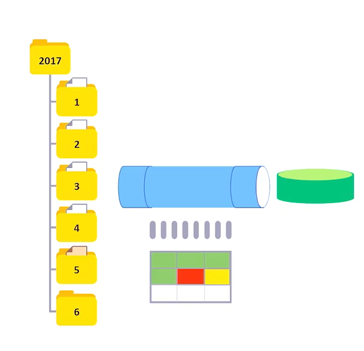
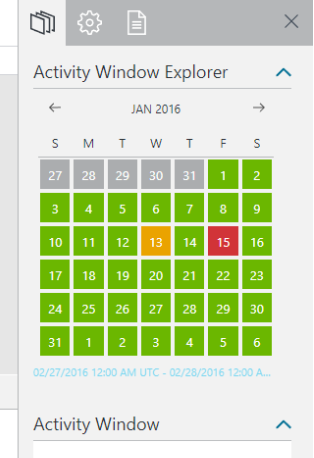
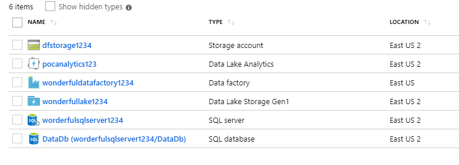
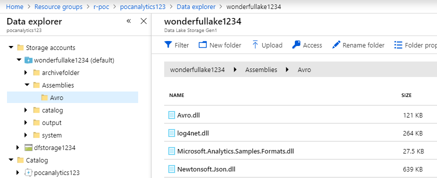
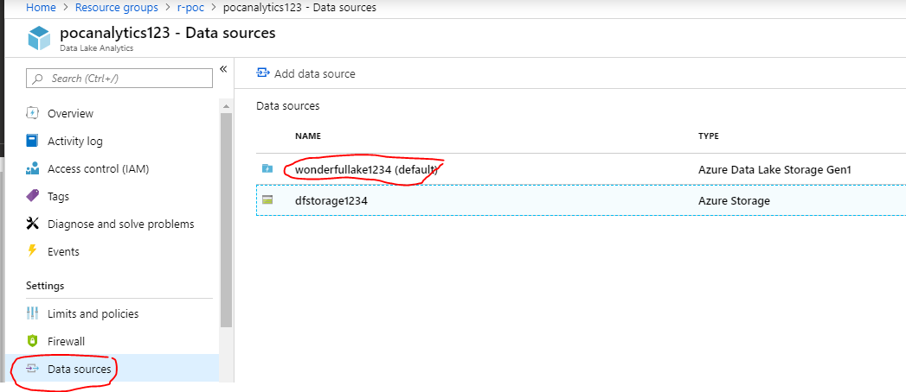
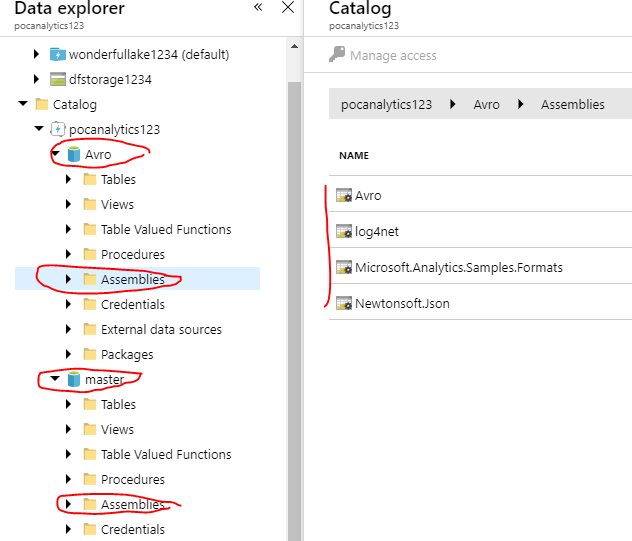
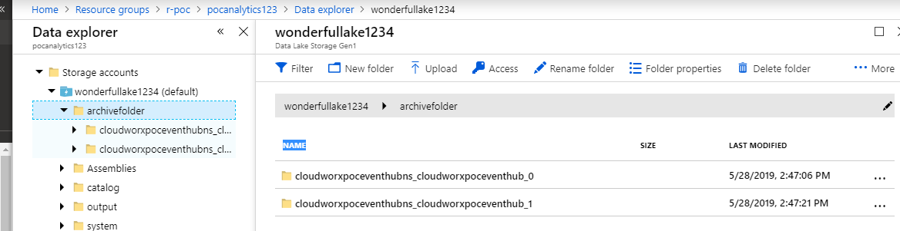

# Overview

In the Event Logs Ingestion & Storage post, I demonstrated ingesting events into a Azure Event Hub and then archiving the data in Avro format into a Data Lake. The Event Hub capture was set to accumulate data by month, by specifying the capture format as :

```javascript
"{Namespace}_{EventHub}_{PartitionId}/{Year}/{Month}/{Day}_{Hour}_{Minute}_{Second}"
```

This will result in monthly folders. Say, we had specified a Event Hub partition size of 2. Then, taking the month January as an example,  we will have files dropped into our two partition folders as follows:

```
archivefolder\cloudworxpoceventhubns_cloudworxpoceventhub_0\2018\01\22_16_30_03.avro
archivefolder\cloudworxpoceventhubns_cloudworxpoceventhub_1\2018\01\22_16_30_03.avro
```

We can have hundreds of files dropped into the January folder, as for each {Day}_{Hour}_{Minute}_{Second} combination, we get a file drop.  (You can view the raw data in the source code folder, under a folder called "Data")

Also, we will have 12 folders created, one for each month.

Now our objective is to automate the extraction and curation of this monthly data by a process that can be scheduled to run once every month.  For this we will use Azure Data Factory


# Azure Data Factory

**What is Azure Data Factory**

>Data Factory is a cloud-based data integration service that **automates the movement and transformation of data**. Just like a factory that runs equipment to take raw materials and transform them into finished goods, Data Factory orchestrates existing services that collect raw data and transform it into ready-to-use information.

> Data Factory allows you to create data-driven workflows to move data between both on-premises and cloud data stores as well as process/transform data using compute services such as Azure HDInsight and Azure Data Lake Analytics. After you create a pipeline that performs the action that you need, you can schedule it to run periodically (hourly, daily, weekly etc.).

For more information, see [Overview & Key Concepts](https://docs.microsoft.com/en-us/azure/data-factory/v1/data-factory-introduction).

Using Data Factory, we want to build a pipeline that can run once a month on our monthly  folders in the Data Lake, extract the desired data, (which resides compressed as byte data, and has an Avro format),  transform it as legible CSV data, and finally store the output as CSV files in an output folder in the Data Lake.



For the purpose of this example, we have set up a monthly run schedule. With Data Factory, we can choose to run jobs at a lower time granularity: say by Day or  by Hour. Also, we can write jobs that summarize or aggregate data. In our example, we are just extracting device logs from byte/AVRO to CSV, without performing any aggregation.

The pipeline we create will report its progress with a calendar. For a daily extraction schedule in the screenshot below, the "Green" in the calendar shows that jobs have been successfully run. The "Orange" shows that it is waiting for data to become available, and the "red " shows that there was a problem encountered on that day. The administrator can correct the error and rerun the schedule for that day.




# ARM templates

```
ARM Template folder: ARMTemplates\DataFactory\datafactory_poc.json. 
```

You can spin up an environment in Azure using the ARM template linked above. You can run the template in the  Azure portal under *All Services/ Template (preview)*. This will create the following resources:

1. Blob Storage
2. SQL Server
3. Database (DataDb)
4. Azure Data Factory
5. Data Lake
6. Data Lake Analytics



(Note: we will not be using Blob Storage or SQL Server for this POC).


# The Azure Data Lake Analytics Account (ADLA)

## What is ADLA

ADLA is a platform that enables processing of extremely large data sets, integration with existing Data Warehousing, and true parallel processing of structured and unstructured data. ADLA is well equipped to handle many of the types of processing we do in the *T* portion of *ETL*; that is, transforming data. It provides similar functionality like Hadoop (with Hive and Spark).  However, it is simpler to learn & use:  whereas in Hadoop, you encounter the learning curve of mastering any of its six supported languages -- Hive, Pig, Java, Scala, Python, Bash; in ADLA, you just use one: USQL, which is a combination of SQL and C#. Also the pricing of ADALA is per job, which is different from the per hour, (based on how long you keep your cluster running,)  pricing of competing Big Data cloud offerings.  With ADLA, you pay for each individual job that is run. Each job run through ADLA is assigned a number of **Analytic Units (AUs)**. Each job is billed based on how many AUs were used and how many hours the job ran. So a simple job that used 10 AUs for one hour would be billed for 10 processing hours.

As a matter of fact, just owning an Azure Data Lake Analytics account doesn't cost anything. You aren't even billed for the account until you run a job. That's pretty unique in the Big Data space.

For more information, see  [Data Lake Analytics Overview](https://docs.microsoft.com/en-us/azure/data-lake-analytics/data-lake-analytics-overview)

## How we are going to use ADLA

We will create a database in ADLA, and within that database, we will create a stored procedure that will take in a Start Date and an End Date as parameters. When we schedule a  Azure Data Factory pipeline, it will pass in these two parameters.  The stored procedure will use these parameters to determine the folder in the Data Lake to target, and will pick up all the files in that folder, transform it and write the output in an output folder in the Data Lake. There are a number of U-SQL  scripts provided in the source code folder, wrapped within a Visual Studio Solution, which you need to run. The location of the Visual Studio Solution is  in the folder: *CloudworxUSQLApplication*.

## Copy Assemblies to a Data Lake Folder

To parse the AVRO format of our data, and to de-serialize the resultant JSON payload, we need a number of assemblies uploaded to our database (which we will create in a moment). These assemblies have been provided in [Github](https://github.com/Azure/usql/tree/master/Examples/AvroExamples). However, I have included them in the source code download folder at  the *CloudworxUSQLApplication/Lib* location.

In the attached Data Lake, create a folder called *\Assemblies\Avro* and upload the assemblies from the *Source Code/CloudworxUSQLApplication/Lib* to here.




## Create Azure Data Lake Analytics Data Sources

The ARM template we deployed creates a Azure Data Lake Analytics Account with a Data Source for an Azure Data Lake (Gen1). 

**Optional**: The screenshot below also shows a Data Source for a blob storage. We will not be using the blob storage for this POC. However the ARM template creates a blob storage and to create a Data Source for it, do the following:

- In the Azure Data Lake Analytics account, browse to its blade in the Azure portal, and under Settings, click Data Sources.
- Click Add Data Source. Then in the Add Data Source blade, in the Storage Type list, select Azure Storage, and then select your Azure storage account. This adds your Azure storage account as a data source to which the Azure Data Lake Analytics account has access, in addition to its default Azure Data Lake Store.

## Create an Azure Data Lake Analytics Database

Open the provided  Visual Studio solution at the location *..\CloudworxUSQLApplication* and Submit the U-SQL script: *1-CreateDB.usql*. This will create a database called AVRO in the ADLA.


**Script: 1-CreateDB.usql**

```sql
DROP DATABASE IF EXISTS Avro;

CREATE DATABASE Avro;
```


## Copy Assemblies from Data Lake to Azure Data Lake Analytics Database

Open the provided  Visual Studio solution at the location *..\CloudworxUSQLApplication* and Submit the U-SQL script:  *2-RegisterAssemblies.usql*. You will need to run the script two times. First as it is. Then, uncomment the *USE Database AVRO* and submit again. This will then copy the assemblies in both the Master and Avro databases.


**Script: 2-RegisterAssemblies.usql**

```sql
//run this script 2 times. First as it is. Then, uncomment the "USE Database AVRO" and submit again.
//This will then copy the assemblies in both the Master and Avro databases

//USE DATABASE Avro;


DROP ASSEMBLY IF EXISTS [Avro];
CREATE ASSEMBLY [Avro] FROM @"/Assemblies/Avro/Avro.dll";
DROP ASSEMBLY IF EXISTS [Microsoft.Analytics.Samples.Formats];
CREATE ASSEMBLY [Microsoft.Analytics.Samples.Formats] FROM @"/Assemblies/Avro/Microsoft.Analytics.Samples.Formats.dll";
DROP ASSEMBLY IF EXISTS [Newtonsoft.Json];
CREATE ASSEMBLY [Newtonsoft.Json] FROM @"/Assemblies/Avro/Newtonsoft.Json.dll";
DROP ASSEMBLY IF EXISTS [log4net];
CREATE ASSEMBLY [log4net] FROM @"/Assemblies/Avro/log4net.dll";
```


If you now browse the ADLA  with the Data Explorer, you should have copied the assemblies to both the master and the Avro databases:



## Create the Stored Procedure

Open the provided  Visual Studio solution at the location *..\CloudworxUSQLApplication* and Submit the U-SQL script: *sp.usql*. Once you run this script, you should see a stored procedure created in the ADLA Database Avro, in the "Procedures" folder.


**Script: sp.usql**

```sql
DROP PROCEDURE IF EXISTS Avro.dbo.sp_CreateLogs;

CREATE PROCEDURE Avro.dbo.sp_CreateLogs(@DateSliceStart DateTime, @DateSliceEnd DateTime)
AS
BEGIN

    REFERENCE ASSEMBLY [Newtonsoft.Json];
    REFERENCE ASSEMBLY [log4net];
    REFERENCE ASSEMBLY [Avro];
    REFERENCE ASSEMBLY [Microsoft.Analytics.Samples.Formats];


    //These external parameters will be populated by ADF based 
    //on the time slice being  	executed.
    
    DECLARE EXTERNAL @DateSliceStart DateTime = System.DateTime.Parse("2018/01/01");
    DECLARE EXTERNAL @DateSliceEnd DateTime = System.DateTime.Parse("2018/03/01");

    //These are intermediary variables which inherit the time element
    //from the ADF time 	slice.
    
    DECLARE @YearNbr int = @DateSliceStart.Year;
    DECLARE @MonthNbr int = @DateSliceStart.Month;
    DECLARE @DayNbr int = @DateSliceStart.Day;

    //These are used to align the Year/Month/Day partitioning of the input & output.
    //This technique also allows U-SQL to dynamically generate different output file 	 //path & name.
    
    DECLARE @YearString string = @YearNbr.ToString();
    DECLARE @MonthString string = @MonthNbr.ToString().PadLeft(2, '0');
    DECLARE @DayString string = @DayNbr.ToString().PadLeft(2, '0');

    DECLARE @input_file = 			     "archivefolder/cloudworxpoceventhubns_cloudworxpoceventhub_0/" + @YearString + "/" + @MonthString + "/{*}.avro";

    DECLARE @output_file string = "/output/" + @YearString + "/" + @MonthString + "/" + @YearString + @MonthString + ".csv";

   

    @rs =
        EXTRACT Body byte[]
        FROM @input_file

        USING new Microsoft.Analytics.Samples.Formats.ApacheAvro.AvroExtractor(@"
        {
            ""type"":""record"",
            ""name"":""EventData"",
            ""namespace"":""Microsoft.ServiceBus.Messaging"",
            ""fields"":[
                {""name"":""SequenceNumber"",""type"":""long""},
                {""name"":""Offset"",""type"":""string""},
                {""name"":""EnqueuedTimeUtc"",""type"":""string""},
                {""name"":""SystemProperties"",""type"":{""type"":""map"",""values"":				 [""long"",""double"",""string"",""bytes""]}},
                {""name"":""Properties"",""type"":{""type"":""map"",""values"":						[""long"",""double"",""string"",""bytes""]}},
                {""name"":""Body"",""type"":[""null"",""bytes""]}
            ]
        }
    ");


    @jsonLogs =
        SELECT Microsoft.Analytics.Samples.Formats.Json.JsonFunctions.JsonTuple(Encoding.UTF8.GetString(Body), "..*") AS json
        FROM @rs;

    @logs =
        SELECT json["timestamp"]AS Timestamp,
               json["device"]AS Device,
               json["category"]AS Category,
               json["priority"]AS Priority,
               json["message"]AS Message
        FROM @jsonLogs;


    OUTPUT @logs
    TO @output_file
    USING Outputters.Text();

END;
```


Based on the @DateSliceStart and the @@DateSliceEnd parameters, the stored procedure builds the @input_file variable to grab raw data files from the data lake. This stored procedure currently looks at a data ingested from a single Event Hub partition (*..\\cloudworxpoceventhubns_cloudworxpoceventhub_0*).  The stored procedure  could repeat the process for multiple partitions.


##  Upload the sample data to the Data Lake

If you had followed my previous post on Event Logs Ingestion, you would have a *archivefolder* in the Data Lake that contained the raw data. If you have not followed that post, I have provided sample data in the source code folder, in the "Data" folder.  Use the Microsoft Azure Storage Explorer to upload the "archivefolder" to the Data Lake.




## Test the Stored Procedure

In the ADLA, click on the "New Job" button, paste the following script, and click "Submit"

```sql
Avro.dbo.sp_CreateLogs(System.DateTime.Parse("2018/01/01"),
                       System.DateTime.Parse("2018/01/31"));
```

This should create an output\01 folder in the Data Lake and create a .CSV file in this folder with the transformed output.

Now we are done setting up the Data lake; let us set up the Data Factory.


# Setting up the Data Factory (ADF)

*Note: we are using version 1 of the Azure Data Factory.*

We are going to use Azure Data Factory to schedule monthly runs of the stored procedure we created above. We need to set up the following in the ADF:

1. Linked Service: Linked services are Azure resources the ADF can target. These could be Blobs, SQL Server,  Data Analytics Accounts, Data Lakes. For our POC we will need linked services for our Data Analytics Account (we need to run the U-SQL stored procedure using it), and the Data Lake (our source data and destination output will reside on the Data Lake).
2. Data Sets:  Data Sets are JSON documents that describe (among other things) the structure of the data that our source and destination data will implement, and the Linked Service it will use. We will create two data sets: one for the source data, and one for our transformed data.
3. Pipline:  A Pipeline is a JSON document that describes how the batch transformation will be scheduled, and brings together the input & output data sets. 

## Creating the Azure Data Lake Analytics Linked Service

The ADF must be authorized to access the  Azure Data Lake Analytics Linked Service. In production, you would use [service principal authorization](https://docs.microsoft.com/en-us/azure/data-factory/transform-data-using-data-lake-analytics), but for this POC, you will authorize with your Azure credentials. To do this, follow these steps: 

1. In the Microsoft Azure portal, browse to the blade for your data factory, and click the Author and deploy tile.

2. In the pane on the left, expand Linked Services, and in the **More** menu, click New compute, and then click Azure Data Lake Analytics to create a new JSON document for an Azure Data Lake Analytics service.

3. In the new JSON document, replace the default code with the following code. Replace *pocanalytics123* in the document below with the name of your Azure Data Lake Analytics account. 

   ```json
   {
       "name": "adl-analytics",
       "properties": {
           "type": "AzureDataLakeAnalytics",
           "typeProperties": {
             "authorization": "<Authorization code is automatically retrieved after 							clicking 'Authorize' and completing the OAuth login>",
             "accountName": "pocanalytics123",
             "sessionId": "<OAuth session id from the OAuth authorization session. 						Each session id is unique and may only be used once>"
         }
       }
   }
   ```

4. Click Authorize, and when prompted enter your Microsoft account credentials to sign into your Azure subscription – this will verify your identity and generate the authorization code and session ID in the JSON document.

5. Click Deploy to deploy the linked service definition to your Azure Data Factory.


## Creating the Data Lake Linked Service

Similar to the Analytics Service, the ADF must be authorized to access the  Data Lake  linked service.

1. In the Microsoft Azure portal, browse to the blade for your data factory, and click the Author and deploy tile.
2. Click New data store, and then click Azure Data Lake Store to create a new JSON document for an Azure Data Lake Store. In the new JSON document, replace the default code with the following code. Replace *wonderfullake1234*  with the name of your Azure Data Lake Store.

```json
{
    "name": "adl-store",
    "properties": {
        "type": "AzureDataLakeStore",
        "description": "",
        "typeProperties": {
          "authorization": "<Click 'Authorize' to allow this data factory 
          and the activities it runs to access this Data Lake Store with your access 
          rights>",
          "dataLakeStoreUri": 	          "https://wonderfullake1234.azuredatalakestore.net/webhdfs/v1",
          "sessionId": "<OAuth session id from the OAuth authorization session. 
          Each session id is unique and may only be used once>"
      }
    }
}
```


## Create the source Data Set

1. In the Microsoft Azure portal, browse to the blade for your data factory, and click the Author and deploy tile.

2. In the More menu, click New dataset, and then click *Azure Data Lake Store*
3. Copy and paste the following document. (Available at: source code\Azure Data Factory\dsRawData.json )

```json
{
    "name": "dsRawData",
    "properties": {
        "structure": [
            {
                "name": "body",
                "type": "String"
            }
        ],
        "published": false,
        "type": "AzureDataLakeStore",
        "linkedServiceName": "adl-store",
        "typeProperties": {
            
            "folderPath": "archivefolder/cloudworxpoceventhubns_cloudworxpoceventhub_0/{Year}/{Month}/",
            "format": {
                "type": "TextFormat",
                "columnDelimiter": " "
            },
            "partitionedBy": [
                {
                    "name": "Year",
                    "value": {
                        "type": "DateTime",
                        "date": "SliceStart",
                        "format": "yyyy"
                    }
                },
                {
                    "name": "Month",
                    "value": {
                        "type": "DateTime",
                        "date": "SliceStart",
                        "format": "MM"
                    }
                }
            ]
        },
        "availability": {
            "frequency": "Month",
            "interval": 1
        },
        "external": true,
        "policy": {
            "validation": {
                "minimumSizeMB": 0.01
            }
        }
    }
}
```


## Create the destination Data Set

1. In the Microsoft Azure portal, browse to the blade for your data factory, and click the Author and deploy tile.

2. In the More menu, click New dataset, and then click *Azure Data Lake Store*
3. Copy and paste the following document. (Available at: source code\Azure Data Factory\dsTransformed.json )

```json
{
    "name": "dsTransformed",
    "properties": {
        "structure": [
            {
                "name": "Timestamp",
                "type": "String"
            },
            {
                "name": "Device",
                "type": "String"
            },
            {
                "name": "Category",
                "type": "String"
            },
            {
                "name": "Message",
                "type": "String"
            }
        ],
        "published": false,
        "type": "AzureDataLakeStore",
        "linkedServiceName": "adl-store",
        "typeProperties": {
            "fileName": "summary.csv",
            "folderPath": "output/summary/{Year}/{Month}",
            "format": {
                "type": "TextFormat",
                "columnDelimiter": ","
            },
            "partitionedBy": [
                {
                    "name": "Year",
                    "value": {
                        "type": "DateTime",
                        "date": "SliceStart",
                        "format": "yyyy"
                    }
                },
                {
                    "name": "Month",
                    "value": {
                        "type": "DateTime",
                        "date": "SliceStart",
                        "format": "MM"
                    }
                }
            ]
        },
        "availability": {
            "frequency": "Month",
            "interval": 1
        }
    }
}

```


## Create the Pipeline

1. In the Microsoft Azure portal, browse to the blade for your data factory, and click the Author and deploy tile.

2. In the Pipelines  section, right- click  and select *New pipeline*.
3. Copy and paste the following document. (Available at: source code\Azure Data Factory\pipeline.json )

```json
{
    "name": "Pipeline Logs",
    "properties": {
      "activities": [
        {
          "type": "DataLakeAnalyticsU-SQL",
          "typeProperties": {
            "script": "Avro.dbo.sp_CreateLogs(System.DateTime.Parse(@DateSliceStart), System.DateTime.Parse(@DateSliceEnd));",
            "degreeOfParallelism": 2,
            "priority": 100,
            "parameters": {
              "DateSliceStart": "$$Text.Format('{0:yyyy-MM-ddTHH:mm:ssZ}', SliceStart)",
              "DateSliceEnd": "$$Text.Format('{0:yyyy-MM-ddTHH:mm:ssZ}', SliceEnd)"
            }
          },
          "inputs": [
            {
              "name": "dsRawData"
            }
          ],
          "outputs": [
            {
              "name": "dsTransformed"
            }
          ],
          "policy": {
            "timeout": "01:00:00",
            "concurrency": 2,
            "executionPriorityOrder": "OldestFirst",
            "retry": 2
          },
          "scheduler": {
            "frequency": "Month",
            "interval": 1
          },
          "name": "U-SQL Script to Summarize Logs",
          "linkedServiceName": "adl-analytics"
        }
    
      ],
      "start": "2018-01-01T00:00:00Z",
      "end": "2018-02-01T23:59:59Z",
      "pipelineMode": "Scheduled"
    }
  }
```

Note that we have just scheduled 1 months run (start on Jan 1 and ends on Feb 1). You can change the end month to 12 for all 12 months.

## Verify

The pipeline should start running and can be viewed under the *Monitor & Manage* tab in the Data Factory. Very soon, you should see transformed output in the Data Lake output folder.

## Source Code

